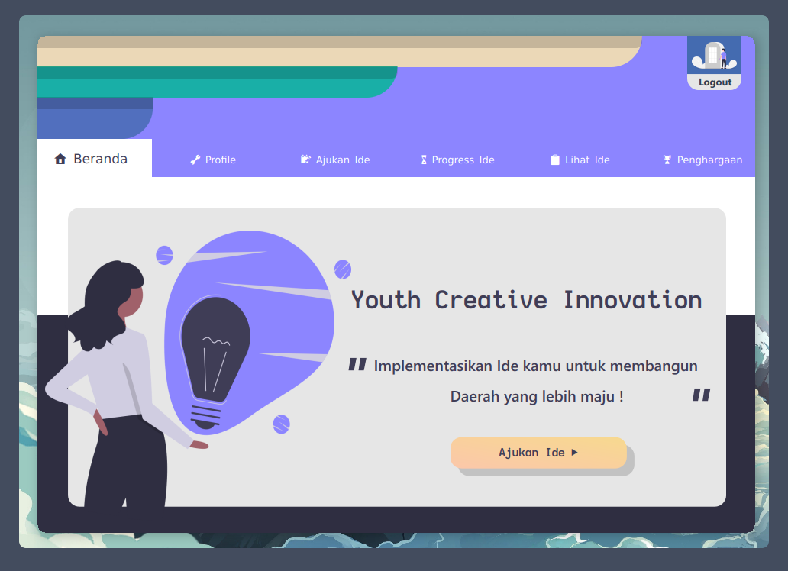
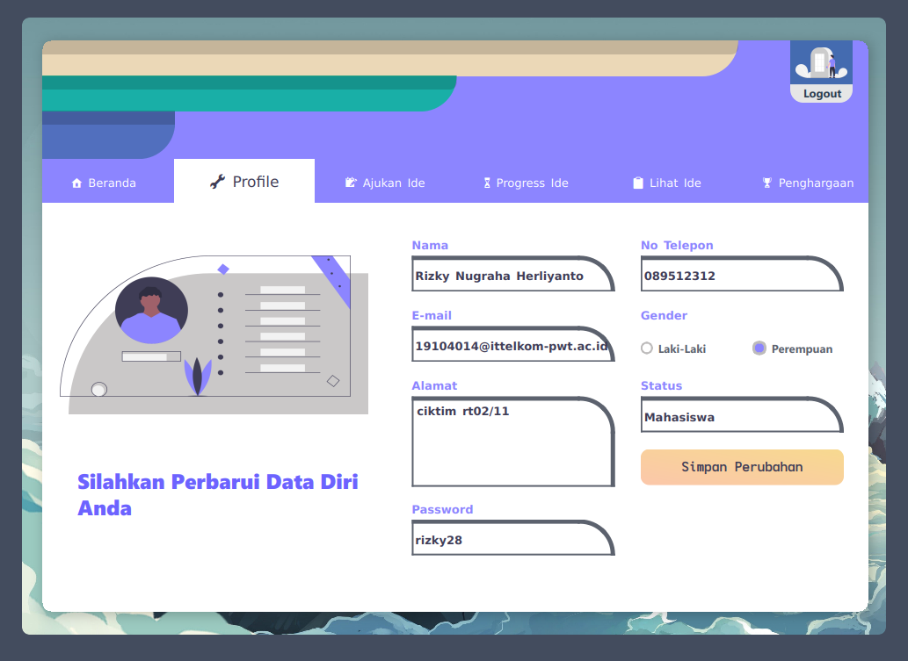
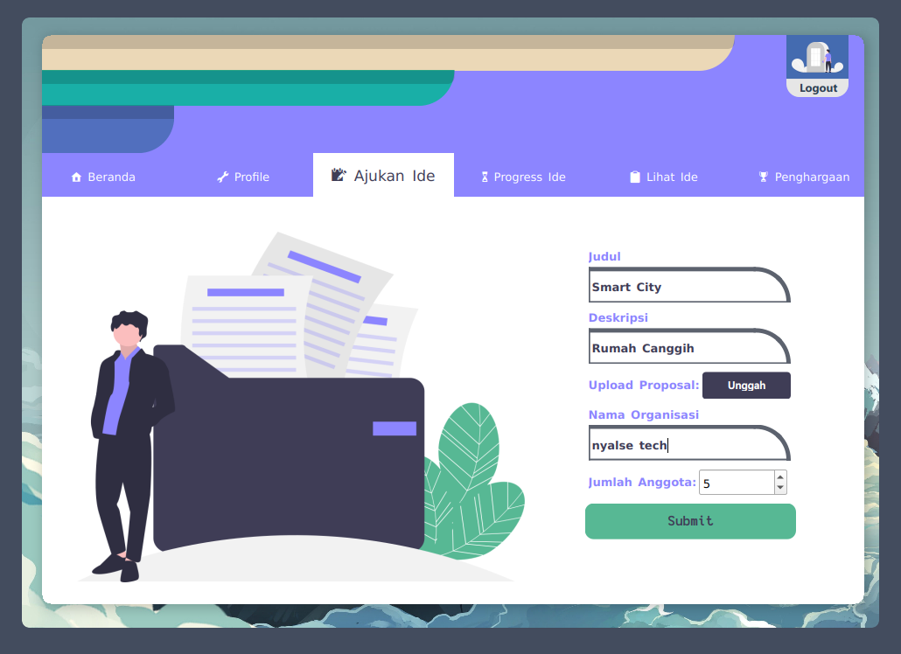
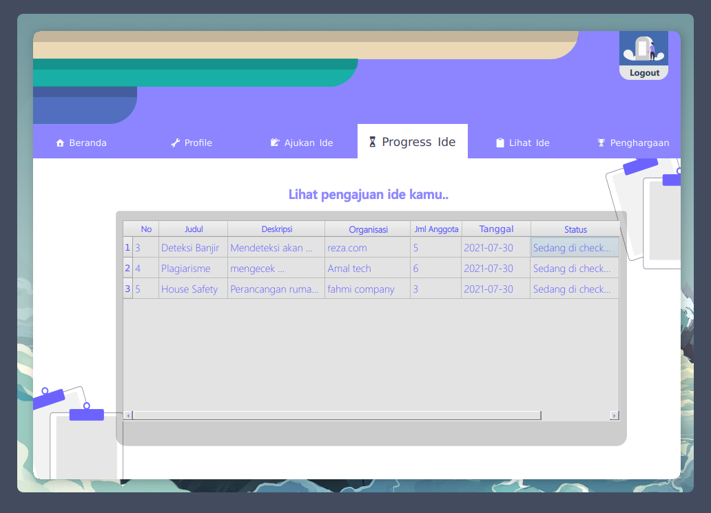
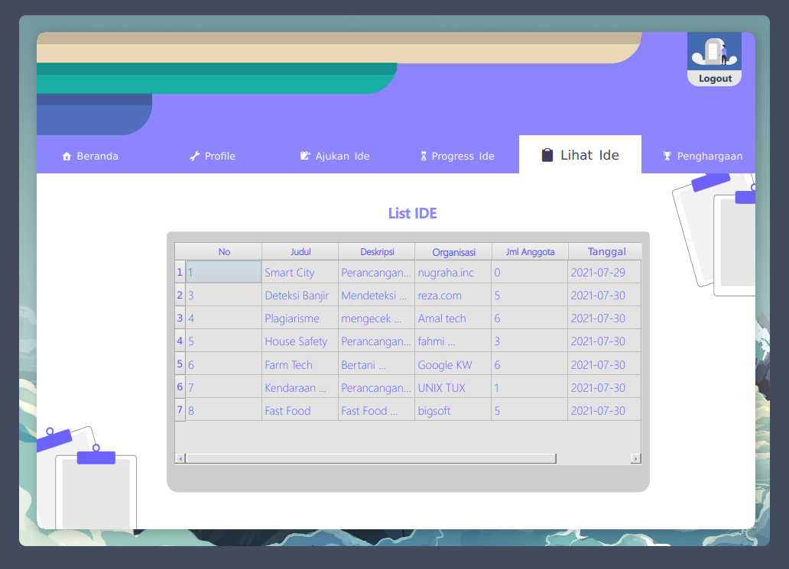

<p align="center">
  <a name="top" href="#octocat-hi-there-thanks-for-visiting-">
     
  </a>
</p>

## :rice_scene: Pendahuluan
Assalamualikum wr.wb, Perkenalkan kelompok kami yang beranggotakan :
| Nama | NIM | Kelas |
| -- | -- | -- |
| :boy: : **Rizky Nugraha Herliyanto** | 19104014 | SE03A |
| :boy: : **Fahmi Muhammad Khairy** | 19104023 | SE03A |
| :boy: : **Amal Nur Faizi** | 19104024 | SE03A |
| :boy: : **Ananda Reza Kurniawan** | 19104061 | SE03A |

### :: Soal ::
    1.  Pilihlah sebuah kasus untuk diselesaikan menggunakan aplikasi GUI 
    2.  Buatlah sebuah aplikasi dengan menerapkan bahasa pemrograman Python
        dengan framework PyQt Sesuai dengan kasus yang dipilih pada nomor[1]
    3.  Lengkapi dokumen perancangan aplikasi seperti:
            a.  Use Case Diagram (Role yang tersedia pada aplikasi);
            b.  Desain Database;
    4.  Terpkan beberapa fitur pada PyQT dalam aplikasi anda seperti:
            a.  Kelas Kontrol (Widget) / non kontrol;
            b.  Form/Dialog;
            c.  Multimedia;
            d.  Terkoneksi dengan database;
    5.  Upload aplikasi melalui github dan berikan panduan penggunan serta
        screenshot pada readme yang lengkap dan jelas.

## :star: Pembahasan

### :: Youth Creative Innovation ::

Disini kelompok kami membuat sebuah program  pengajuan ide inovasi
dengan nama **Youth Creative Innovation** program ini menggunakan
**Python** sebagai bahasa pemrogramannya dan **PyQT** sebagai frameworknya.

Pada dasarnya program ini dibuat untuk pengajuan ide-ide yang kreatif
kepada orang-orang untuk mengembangkan kreativitasnya di daerah-daerah
bisa berupa ide makanan oleh-oleh, wisata, ataupun kemajuan yang berdampak
pada daerah maupun luar.

**Powered by:**


<a href="https://www.python.org/">
  
</a>
<a href="https://www.qt.io/">
  
</a>
<a href="https://www.mysql.com/">
  
</a>
<a href="https://www.apachefriends.org/index.html">
  
</a>

### :: Use Case Diagram ::

<p align="center">
  <a name="top" href="#octocat-hi-there-thanks-for-visiting-">
     
  </a>
</p>

### :: Desain Database ::

<p align="center">
  <a name="top" href="#octocat-hi-there-thanks-for-visiting-">
     
  </a>
</p>

### :: Tampilan Program ::

[<a href="https://github.com/lordacil/TUBES_GUI/blob/main/Class/main.py">main.py</a>] Using **Widget** and **Main Window**

[<a href="https://github.com/lordacil/TUBES_GUI/blob/main/Class/dashboard.py">dashboard.py</a>] Using **Widget** and **Dialog**

> **MAIN FORM - Login**


> **MAIN FORM - Register**


> **DASHBOARD FORM - Home**




> **DASHBOARD FORM - Profile**




> **DASHBOARD FORM - Pengajuan Ide**




> **DASHBOARD FORM - Progress Ide**




> **DASHBOARD FORM - Lihat Ide**




> **DASHBOARD FORM - Winner Ide**


*Note : disini pemenang diambil dari status progressnya = "Selamat anda lolos!" sesuai dengan query

## :cyclone: Panduan Penggunaan Program

### 1. Install Python

<details>
  <summary>install di <kbd>Windows</kbd></summary>
  
 - ```bash
    Download Python di situs resminya pilih yang windows installer
    ```
  - ```bash
    Tinggal ikuti perintah step-by-stepnya
    ```
  - ```bash
    $ python -v  # jika sudah selesai ketik command berikut pada terminal kalian untuk mengecek versi dan jika bisa berarti sudah tersintall pythonnya
    ```
  - berikut link lengkap tutorialnya : [install-Python-di-Windows](https://www.petanikode.com/python-windows/)
  
  </details>
  
  <details>
  <summary>install di <kbd>Arch Linux</kbd></summary>
  
 - ```bash
    Install Python lewat Pacman
    ```
 - ```bash
    $ sudo pacman -Sy python  # ketik command berikut pada terminal kalian:
    ```
 - ```bash
    $ python -v  # jika sudah selesai ketik command berikut pada terminal kalian untuk mengecek versi dan jika bisa berarti sudah tersintall pythonnya
    ```
 - ```bash
    masukkan password user kalian lalu ketik (y) untuk setuju
    dan tunggu proses download dan installna selesai secara otomatis......
    ```
 - ```bash
    Dan Python pun seharusnya telah terinstall di laptop/pc kalian
    ```
 - ```bash
    $ python -v  # ketik command berikut pada terminal kalian untuk mengecek versi dan jika bisa berarti sudah tersintall
    ```
  
  </details>
  
### 2. Install Framework PyQT

 - ```bash
    Untuk menginstall PyQt Buka Terminal/CMD
    > ketik command berikut:
    > $ pip install pyqt
    > cara tersebut menggunakan manajemen paket python yaitu "pip"
    ```

### 3. Clone/Download Github ini

- ```bash
    Untuk cara clone github:
    > masuk ke repo awal ini
    > lalu ada tombol warna hijau yang ada tulisan "code"
    > tekan, dan copy yang https
    > lalu buka terminal/CMD lalu ketikkan : git clone link-repo
    ```
- ```bash
    Untuk cara downlod github:
    > masuk ke repo awal ini
    > lalu ada tombol warna hijau yang ada tulisan "code"
    > tekan, dan tekan lagi tulisan "Download ZIP"
    ```

### 4. Jalankan Server XAMPP MySql dan Import Databasenya

- ```bash
    Buka XAMPP GUI
    > click connect mysql dan apache
    > buka browser dan ketik : http://localhost/phpmyadmin/
    > lalu ada tombol menu "impor" diatas dan tekan
    > lalu browse file .sql yg sudah didownload
    > dan import berhasil
    ```

### 5. Buka Terminal / CMD

- ```bash
    Untuk menjalankan Buka Terminal/CMD
    > ketik command berikut:
    > $ python main.py
    ```
### 6. Program Berhasil Dijalankan

=====================================================================================
